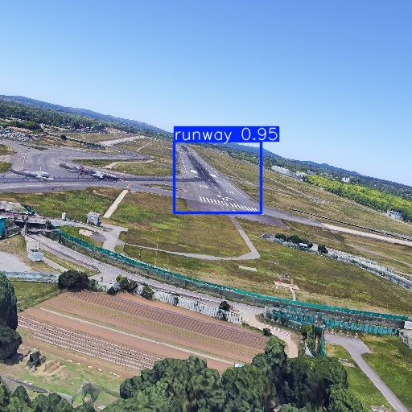

# SwMF-LARD-YOLO-ICPR26

This repository contains the code to reproduce the experiments of ICPR 2026 paper "**Unifying Runtime Monitoring Approaches for Safety-Critical Machine Learning: Application to Vision-Based Landing**". In this project, SwMF (Swiss cheese Monitoring Framework) is used to monitor a YOLOv5 (You Only Look Once) model performing object detection for a vision-based runway detection task, on the LARD (Landing Approach Runway Detection) dataset.

<div align="center">

<br>

<div style="text-align: center; width:80%">

*Prediction of a YOLOv5 model on an image from the LARDv1 dataset (test split)*
</div>

</div>

## Directory structure

```
.
├── data/                       # Directory that contains datasets, models, ...
|   ├── runways_database_all.json   # Database of all runway points (from LARD)
|   └── ...
├── notebooks/                  # Jupyter notebooks for experiments and pipeline
│   ├── data-download.ipynb         # Download datasets
│   ├── data-exploration.ipynb      # Explore datasets
│   ├── data-export.ipynb           # Export datasets (train/valid/test)
│   ├── ml-yolo.ipynb               # Model training notebook
│   ├── ODD.ipynb                   # Exploration of ODD verification
│   ├── OOD.ipynb                   # Exploration of OOD verification
│   └── threats-generation.ipynb    # Corrupted data notebook
├── results/                    # Results, logs, and figures produced by experiments
|   ├── lard_512x512_full/          # Original dataset (download + export)
|   |   └── analysis/                   # ODD and OOD analyses
|   └── lard_512x512_ICPR2026/      # Filtered dataset (original + filter out-of-ODD)
|       └── analysis/                   # ODD and OOD analyses
├── swmf/                       # SwMF (Swiss cheese Monitoring Framework) core code
│   ├── models/                     # Model architectures and utils
│   ├── monitors/                   # Monitoring methods
|   |   ├── ODD/                        # ODD monitors folder
|   |   ├── OMS/                        # OMS monitors folder
|   |   └── OOD/                        # OOD monitors folder
│   └── ...                         # Additional SwMF modules
├── icpr2026_experiment.ipynb   # ICPR main experiment notebook
├── requirements.txt            # (Optional) Python dependencies
├── README.md                   # This file
└── ...
```

## Requirements

- `Python 3.10`
- `uv` package manager (recommended)

*Note, the project has been developed using the `uv` package manager. Yet, using `pip` or `conda` is also possible.*

## Installation

### 0. Install `uv`

First, make sure to have the `uv` package manager installed. You can refer to [this](https://docs.astral.sh/uv/getting-started/installation/#installation-methods) page for details about download or run the commands below.

- On Linux/Mac (recommended):

```sh
curl -LsSf https://astral.sh/uv/install.sh | sh
```

- On Windows:

```powershell
powershell -c "irm https://astral.sh/uv/install.ps1 | iex"
```

- With `pip` (not recommended):

```sh
pip install uv
```

### 1. Install Python (3.10) if needed

```sh
uv install python 3.10
```

### 2. Create a virtual environment and activate it

```sh
uv venv (--python 3.10)
```

### 3. Install the dependencies

#### Minimal environment for main experiment (ICPR 2026) + CPU

Useful for running the `icpr2026_experiment.ipynb` notebook, using the CPU for models and monitors inference.

```sh
uv sync --extra cpu
```

#### Minimal environment + GPU

```sh
uv sync --extra cpu
```

#### Full environment + CPU

Useful for running the notebooks provided at `./notebooks/`, using CPU for YOLO training (slow).

```sh
uv sync --extra cpu --group full
```

#### Full environment + GPU

Useful for running the notebooks provided at `./notebooks/`, using GPU for YOLO training (slow).

```sh
uv sync --extra gpu --group full
```

Install `torch`, `torchvision`, and `ultralytics` packages specific for CUDA 12.8 GPU.

### Alternative installation (not recommended)

Create a virtual environment and install the dependencies using the `requirements.txt` file and your favourite package manager (pip, poetry, conda...).

## Usage

The experiment results presented in the ICPR paper were obtained with the [`icpr2026_experiment.ipynb`](./icpr2026_experiment.ipynb) notebook. Use the notebook to rerun the experiment on your own, full experiment is contained in this notebook.

### 1. Alternative notebooks

- **Dataset download**.

    Open and run [`notebooks/data-download.ipynb`](./notebooks/data-download.ipynb) to download the [LARD](https://github.com/deel-ai/LARD/tree/LARD_V1) (v1) dataset.

    ***Warning**: the automated download does not work anymore, manually download is necessary (see instructions in the notebook).*

- **Dataset export**.

    Open and run [`notebooks/data-export.ipynb`](./notebooks/data-export.ipynb) to export the dataset to the proper format for [YOLO](https://docs.ultralytics.com/fr/models/yolov5/). Also filter data to only keep the images compliant with the ODD.

- **Model training**.

    Open and run [`notebooks/ml-yolo.ipynb`](./notebooks/ml-yolo.ipynb) to train the YOLO object detection model that will be monitored at runtime.

    *Note that all steps are deterministic, with a fixed random seed set in each notebook where necessary. For different settings, modify the seed inside the notebooks.*

### 2. Experiment notebook

- **Main experiment**.

    Run the [`icpr2026_experiment.ipynb`](./icpr2026_experiment.ipynb) notebook. This notebook integrates data loading from exported datasets, model inference, monitors training and testing, results computation and saving.

    *Note that all steps are deterministic, with a fixed random seed set in each notebook where necessary. For different settings, modify the seed inside the notebooks.*

### 3. Results

- Results (standard ML object detection metrics and safety-oriented metrics) will be found in the [`results/`](./results/) directory upon completion.

## License

This project is licensed under the MIT license. See the [LICENSE](./LICENSE) file for more details.

## Citation

You can read the associated paper at [todo]().

---
For any questions, please contact <mathieu.dario@laas.fr>
